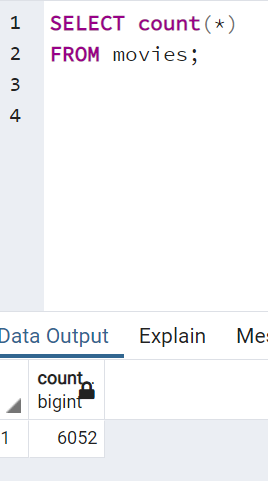
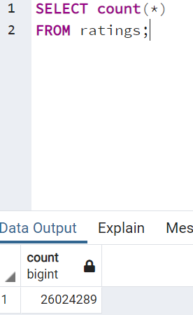

# Movies-ETL
Amazing prime video team wants to known which movies will become popular and then buy the stearmming rights. 

## Overview of Project 
### Purpose 
The purpose is to develop an algorithm to predict which low budget movies that will become popular, using th ETL process, starting with extract the data from two sources: Wikipedia and the movie's land website. Then to Transform the data and prepared using a jupyter notebook as the main tool, cleaning and getting ready to move to PostgreSQL database, the last step is load, in this part is easier to visualize the tables data. 

## Results 

After a large cleaning data and deep analysis, the movies table has 6,052 rows of data, in this table, we can observe each movie with their imdb ID, kaggle ID, the Wikipedia URL, the country, the spoken language, and some more helpful information for Amazing to make a decision.

Also was a large cleaning data and deep analysis, this table has 26, 024, 289 rows of data, and is possible to observe that the movie ID, of course the rating and timestamp, with this information is easier to identify the most popular movies.

### Summary
Finally, this project was a real challenge because, was a large process that have to repeat again and again, but is very helpful, so is important to have the best result is important to extract data from a good source, use the iterate process of "plan, inspect and execute" to do a best way to transform the data and finally, load the data in a trustworthy database.

